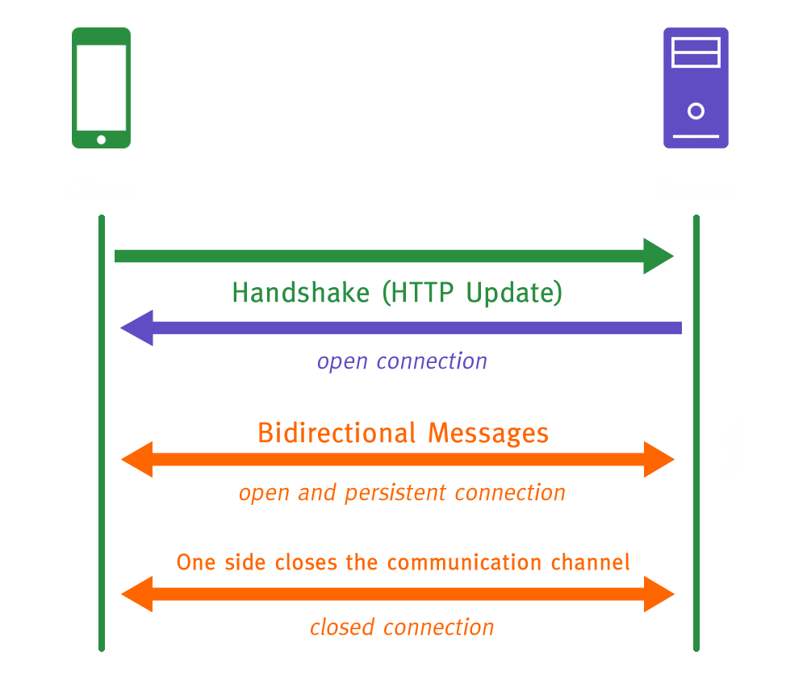
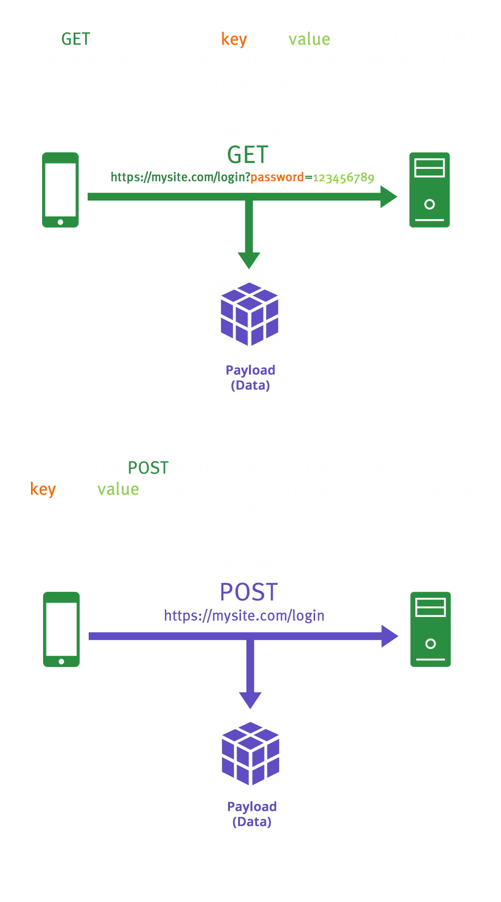

## Handshake

**Translations**

- [EN-US](./handshake.md)
- [PT-BR](./pt_br/handshake.md)

## Navigation

<b>Menu</b>

- [What is a Handshake](#what-is-a-handshake)
- [Handshake Methods](#handshake-methods)
- [Credits](#credits)

 

# What is a Handshake
- What is a Handshake
  - It is when requests (methods) are sent or received in a system or application.

  

	

  

# Handshake Methods

- **GET**: Using `GET` you request data from a resource (server);
  - Returns key and value in the URL;
  - Best used when working with APIs.
- **POST**: Using `POST` you can send data to the server, create/update a resource;
  - Does not return key and value in the URL;
  - Best used for forms with information that must remain private.

**Examples**:

**GET** https://mywebsite.com/page?key=value

**POST**: http://mywebsite.com/page

- Client: User;
- Server: Server (Data Center).

	

 

- **HEAD**: It is the `GET` method that does not return anything in the body of the webpage.
- **PUT**: It is the `POST` method that does not perform a full handshake if the sent information is the same.
 
 

 

# Credits

| [ @sdkitagawa](https://github.com/sdkitagawa) |
| :---: |
