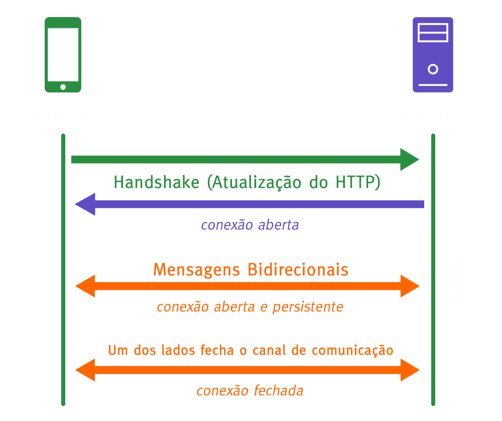
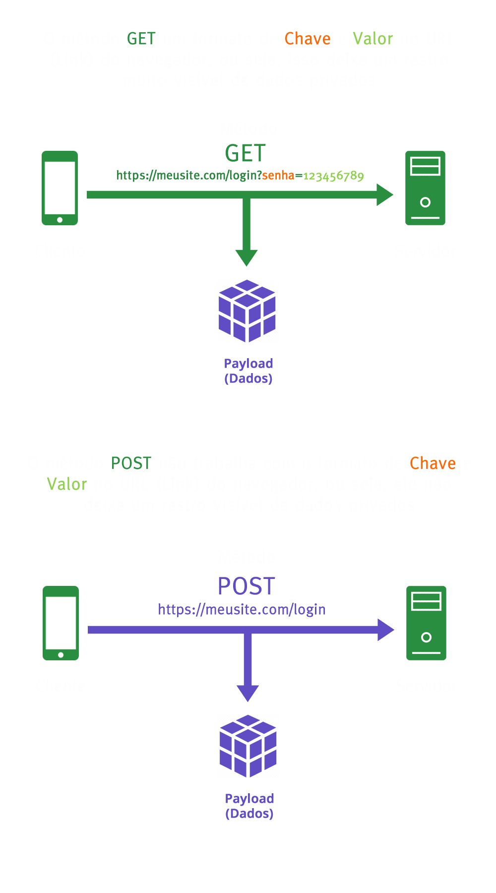

## Handshake

**Translations**

- [EN-US](../handshake.md)
- [PT-BR](./handshake.md)

## Navigation

<b>Menu</b>

- [O que é o Handshake](#o-que-é-o-handshake)
- [Métodos de Handshake](#métodos-de-handshake)
- [Credits](#credits)

 

# O que é o Handshake
- O que é o Handshake
  - É quando há envio ou recebimento de requisições (métodos) em um sistema ou aplicação.

  

	

  

# Métodos de Handshake

- **GET**: Usando `GET` você faz requisição de dados de um recurso (servidor);
  - Retorna chave e valor no endereço;
  - Melhor aproveitado quando usado para APIs.
- **POST**: Usando `POST` você pode enviar dados para servidor, criar/atualizar um recurso;
  - Não retorna chave e valor no endereço;
  - Melhor usado para formulários com informações que devem permanecer privadas.

**Exemplos**:

**GET** https://meusite.com/pagina?chave=valor

**POST**: http://meusite.com/pagina

- Client: Usuário;
- Server: Servidor (Data Center).

	

 

- **HEAD**: Ele é o método `GET` que não retorna nada no corpo (body) da página web.
- **PUT**: Ele é o método `POST` que não efetua um novo handshake completo caso a informação enviada seja a mesma.
 
 

# Credits

| [ @sdkitagawa](https://github.com/sdkitagawa) |
| :---: |
