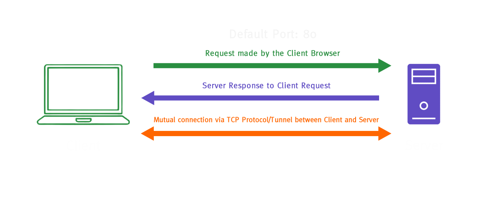
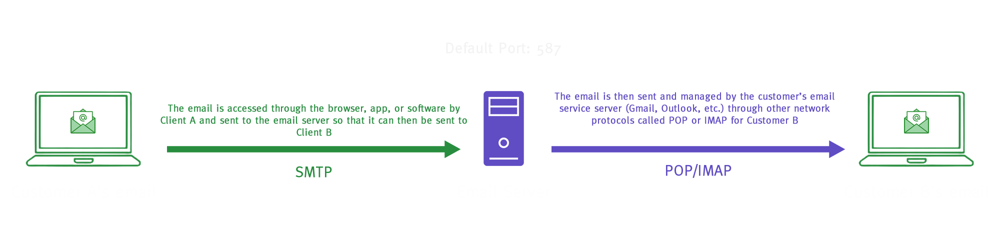
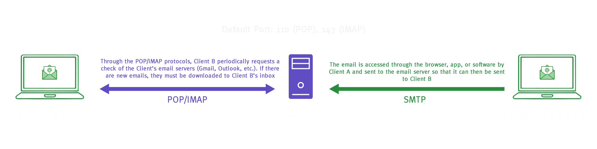
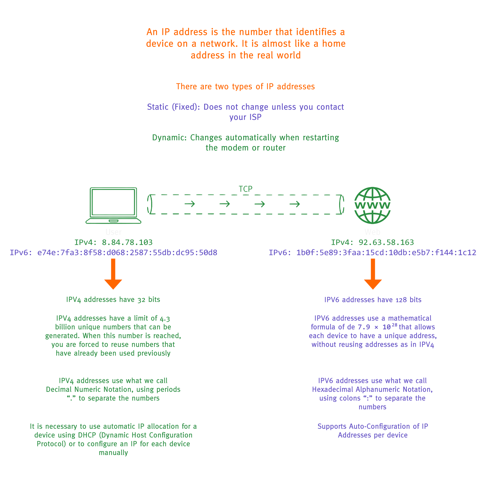
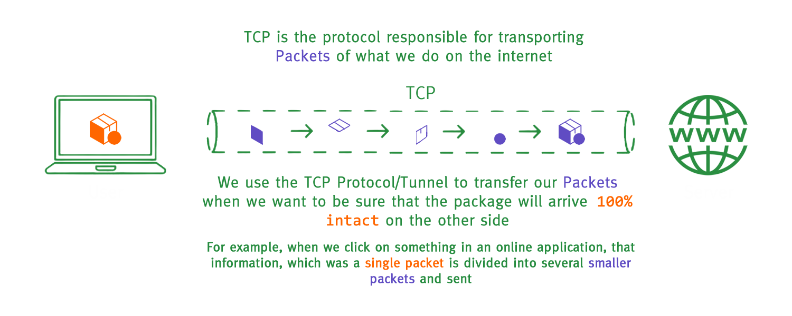
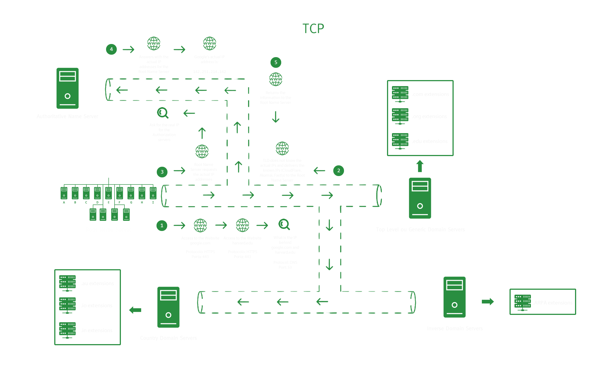

## Basic Network Protocols

**Translations**

- [EN-US](./network_protocols.md)
- [PT-BR](./pt_br/protocolos_de_rede.md)

## Navigation

<b>Menu</b>

- [Introduction](#introduction)
- [HTTP](#http)
- [HTTPS](#https)
- [FTP](#ftp)
- [SMTP](#smtp)
- [POP \& IMAP](#pop--imap)
- [IP](#ip)
- [TCP](#tcp)
- [UDP](#udp)
- [DNS](#dns)
- [SSH](#ssh)
- [Credits](#credits)

 

# Introduction

Protocols are nothing more than a standard agreement to establish communication between two or more parties.

 
 

# HTTP

1. It stands for **Hyper Text Transfer Protocol**.
2. **Hyper Text** refers to the connections between documents that contain references to each other **through hyperlinks**.
3. It is a protocol that defines the rules for transferring these documents.
4. The protocol is responsible for making a request from a **Client** to a **Server** and the response from a **Server** to a **Client**.
5. It depends on the [**TCP**](#tcp) protocol.
6. Primarily used in web page navigation (browsing).
7. Uses the **Default Port 80**.
 
 

 

 
 
 

# HTTPS

1. It stands for **Secure Hypertext Transfer Protocol**.
2. It works exactly like **HTTP** (therefore, it inherits all the previous characteristics of **HTTP**).
3. The communication security is done through a **public key**, a **private key**, and a **session key**.
4. The **S** for security comes from the **encryption** layer, which serves to protect the transfer of your data during browsing.
5. **Encryption**, roughly speaking, is a way to **scramble data and/or information**, and **only those with the method or technique can unscramble** and then understand this information.
6. Uses the **Default Port 443**.
 
 

 

 
 

# FTP

1. It stands for **File Transfer Protocol**.
2. It is a protocol dedicated to **file transfer**.
3. There are **Public FTPs**, **Anonymous FTPs**, **Secure FTPs**, among other types.
4. FTPs **may require a username and password**.
5. It supports **interaction via the Terminal**.
6. Mainly used for **file transfers** and **downloads**.
7. Uses the **Default Port 587**.
 
 

 

 
 
 

# SMTP

 
 

1. It stands for **Simple Mail Transfer Protocol**.
2. It is a protocol dedicated to **email transfer**.
3. It **moves emails** between servers.
4. Mainly used in **email services**.
5. Uses the **Default Port 587**.

 
 

 

 
 
 

# POP & IMAP

1. **POP** stands for **Post Office Protocol**.
2. **IMAP** stands for **Internet Message Access Protocol** or **Internet Message Access Protocol**.
3. Both protocols are responsible for **requesting emails from servers and downloading new emails**.
4. The **IMAP** protocol has a **higher security layer** and works with **dynamic synchronization**.
5. It is capable of adding **flags** (**markers**) such as **tracking**, **read** or **unread status**, and others.
6. Mainly used in **email services**.
7. **POP** uses the **Default Port 110**.
8. **IMAP** uses the **Default Port 143**.
 
 

 

 
 
 

# IP

1. It stands for **Internet Protocol Address**.
2. It is responsible for **identifying devices** on a **network**.
3. It is like a **plate that marks the address** of a device inside **TCP** tunnels.
4. It identifies devices on the network through **numeric addresses of four blocks separated by dots**, which is called **IPv4**.
5. It also identifies devices on the network through **numeric addresses of eight blocks separated by colons**, which is called **IPv6**.
6. Addresses are divided into **local addresses** (internal home network) and **external addresses** (an internet provider network, a server, and others).
7. **IPv4** has **32 bits**.
8. **IPv6** has **128 bits**.
9. **IPv4** has a limit and needs to be **reused**.
10. Used across the **entire internet**.
11. With **IPv6**, each device has its **own unique address**.
 
 

 

 
 
 

# TCP

1. It stands for **Transmission Control Protocol**.
2. It is like one of the options of a **tunnel** through which the other previously mentioned protocols travel.
3. It always works together with the [**IP**](#ip).
4. Understand a **package** or **packet** as a **piece of information that has been split so it can be sent gradually**; this is how we send data over the internet in web pages, applications, online games, etc.
5. **Packets** can be lost during transmission across the network.
6. It has a system called **Error Recovery** to ensure that if **one or more data packets** sent **over a network** are not delivered to their destination, the problem is corrected through **Error Recovery** by resending the same packet.
7. The **Error Recovery** system has a **cost**, which is slower data transmission.
8. It is normally used by **web** or **mobile** applications.
 
 

 

 
 
 

# UDP

1. It stands for **User Datagram Protocol**.
2. It is like one of the options of a **tunnel** through which the other previously mentioned protocols travel.
3. It always works together with the [**IP**](#ip).
4. It does not have **Error Recovery**, which allows the **loss of some packets**.
5. In **video calls**, it can lead to the **loss of image and/or audio frames**.
6. In **online games**, this is what we call **lag**, when a player appears to suddenly teleport from one place to another.
7. It is normally used in **online games** and **video calls**.
 
 

 

 
 
 

# DNS

1. It stands for **Domain Name System**.
2. It can be understood as a **mask that acts as a name** to hide an [**IP address**](#ip).
3. It helps in the process of storing web page content in **cache memory** (**recent memory**).
4. There are **13 different servers spread around the world** that are connected to each other through **submarine cables**.
5. These 13 servers are **distributed across different locations around the world**.
 
 

 

 
 

 
 
 

# SSH

1. It stands for **Secure Shell**.
2. It allows a connection between a **client** and one or more **servers** without requiring authentication every time you need to connect to the server(s).
3. It uses a **public key** and a **private key** (**secret key**).
4. It encrypts the **data** and the **communication**.
 
 

 

 
 
 

# Credits

| [ @sdkitagawa](https://github.com/sdkitagawa) |
| :---: |
