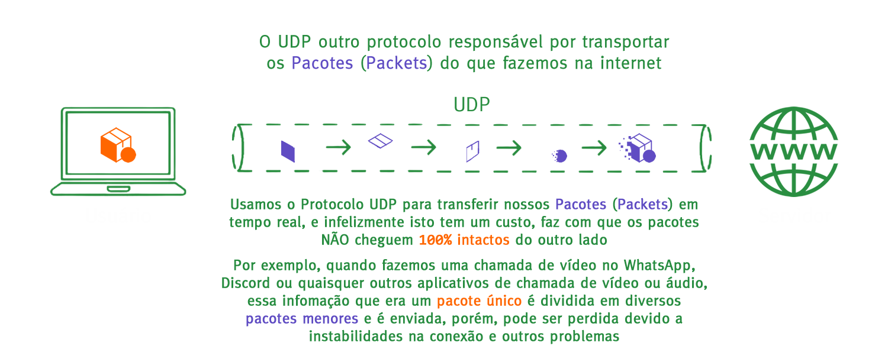
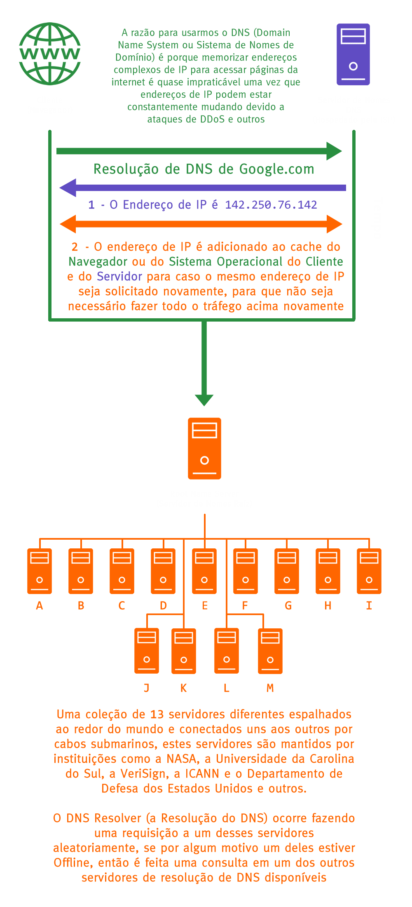
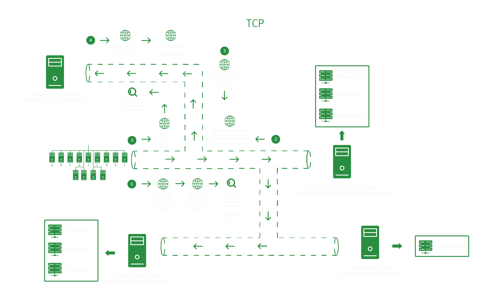

## Protocolos Básicos de Rede

**Tradução**

- [EN-US](../network_protocols.md)
- [PT-BR](./protocolos_de_rede.md)

## Navegação

<b>Menu</b>

- [Introdução](#introdução)
- [HTTP](#http)
- [HTTPS](#https)
- [FTP](#ftp)
- [SMTP](#smtp)
- [POP \& IMAP](#pop--imap)
- [IP](#ip)
- [TCP](#tcp)
- [UDP](#udp)
- [DNS](#dns)
- [SSH](#ssh)
- [Créditos](#créditos)

 

# Introdução

Protocolos são nada mais nada menos que um acordo padrão para estabelecer uma comunicação entre duas ou mais partes.

 
 

# HTTP

1. Significa **Hyper Text Transfer Protocol** ou **Protocolo de Transferência de Hyper Texto**;
2. **Hyper Text** ou **Hyper Texto** faz referência as conexões entre os documentos que contenham referências uns para outros documentos **através de hyper links**;
3. É um protocolo que define regras para transferências desses documentos;
4. Protocolo responsável por fazer a requisição de um **Cliente** para um **Servidor** e a resposta de um **Servidor** para um **Cliente**;
5. Depende do protocolo [**TCP**](#tcp);
6. Usado principalmente em navegação de páginas da internet (web);
7. Usa a **Porta Padrão 80**.
 
 

 

 
 
 

# HTTPS

1. Significa **Hyper Text Transfer Protocol Secure** ou **Protocol de Transferência de Hyper Texto Seguro**;
2. Funciona exatamente como o **HTTP** (logo, herda todas as características anteriores do **HTTP**);
3. A comunicação da segurança é feita através de uma **chave pública**, uma **chave privada** e uma **chave da sessão**;
4. A letra **S** de segurança vem da camada de **criptografia** que serve para proteger a transferência dos seus dados durante a navegação;
5. A **criptografia** de uma maneira grosseira é uma forma de **embaralhar os dados e/ou informações**, e **somente quem tem o método ou a técnica pode desembaralhar** e então entender essas informações;
6. Usa a **Porta Padrão 443**.
 
 

 

 
 

# FTP

1. Significa **File Transfer Protocol** ou **Protocolo de Transferência de Arquivos**;
2. É um protocolo dedicado para **transferência de arquivos**;
3. Existem **FTPs Públicas**, **FTPs Anônimas**, **FTPs Seguras** dentre outros tipos;
4. FTPs **podem ter usuário ou senha**;
5. Possui **interação via Terminal**;
6. Usado principalmente em **transferências de arquivo** e **downloads**;
7. Usa a **Porta Padrão 587**.
 
 

 

 
 
 

# SMTP

 
 

1. Significa **Simple Mail Transfer Protocol** ou **Protocol de Transferência de Correio Eletrônico**;
2. É um protocolo dedicado para **transferência de e-mails**;
3. **Move e-mails** entre servidores;
4. Usado principalmente em **serviços de E-mail**;
5. Usa a **Porta Padrão 587**.
 
 

 

 
 
 

# POP & IMAP

1. Significa **Post Office Protocol** ou **Protocolo de Caixa de Postal**;
2. Significa **Internet Message Access Protocol** ou **Protocol de Acesso as Mensagens da Internet**;
3. Ambos os protocolos são responsáveis por **requisita dos servidores e baixa os novos e-mails**;
4. O protocolo **IMAP** tem uma **camada maior de segurança** e trabalha com **sincronia dinâmica**;
5. Capaz de adicionar **flags** (**marcadores**) de **rastreio**, **status de lido** ou **não lido** e outros;
6. Usados principalmente em **serviços de E-mail**;
7. O **POP** usa a **Porta Padrão 110**;
8. O **IMAP** usa a **Porta Padrão 143**;
 
 

 

 
 
 

# IP

1. Significa **Internet Protocol Address** ou **Endereço Protocolado da Internet**;
2. Responsável por **identificar dispositivos** em **uma rede**;
3. É como uma **placa que demarca o endereço** de um dispositivo dentro dos túneis **TCP**;
4. Identifica dispositivos na rede através de **endereços numéricos de quadro casas separadas por pontos** e este é chamado de **IPv4**;
5. Também identifica dispositivos na rede através de **endereços numéricos de oito casas separadas por sinais de dois ponto** e este é chamado de **IPv6**;
6. Os endereços são divididos entre **endereços locais** (rede interna de uma casa) e **endereços externos** (rede em um provedor de internet, um servidor e outros);
7. O **IPv4** possui 32 bits;
8. O **IPv6** possui 128 bits;
9. O **IPv4** possui um limite precisa ser re-utilizado;
10. Usado na internet como um todo;
11. O **IPv6** cada dispositivo tem seu endereço único.
 
 

 

 
 
 

# TCP

1. Significa **Transmission Control Protocol** ou **Protocol de Controle de Transmissão**;
2. É como uma das opções de um **túnel** pelo qual os demais protocolos anteriores trafegam ;
3. Trabalha sempre em conjunto com o [**IP**](#ip);
4. Entenda um **pacote** ou **packet** como um **pedaço de uma informação que foi dividida para poder ser enviada aos poucos** e é assim que enviamos dados através da internet em páginas de internet, aplicativos, jogos online e etc;
5. Os **pacotes** (**packets**) podem ser perdidos durante a transmissão através da rede;
6. Possui um sistema chamado de **Error Recovery** ou **Recuperação de Erro** para garantir que caso **um ou mais pacotes de dados** sendo enviados **através de uma rede** não sejam entregues ao seu destino o problema é corrigido através do **Error Recovery** enviando novamente o mesmo pacote;
7. O sistema de **Error Recovery** (**Recuperação de Erro**) possui um **custo** que é o de ter uma transmissão dos dados mais lenta;
8. É normalmente utilizado por aplicações **Web** ou **móveis**.
 
 

 

 
 
 

# UDP

1. Significa **User Datagram Protocol** ou **Protocolo de Datagrama do Usuário**;
2. É como uma das opções de um **túnel** pelo qual os demais protocolos anteriores trafegam;
3. Trabalha sempre em conjunto com o [**IP**](#ip);
4. Não se possui **Error Recovery**, possibilitando então a **perda de alguns pacotes**;
5. Em **chamadas de vídeo** pode levar a **perda de frames (quadros)** de **imagem** e/ou **áudio**;
6. Em **jogos online** é o que chamamos de **LAG**, quando um jogador parece se teletransportar de um lugar para o outro repentinamente;
7. É normalmente utilizado em jogos online e chamadas de vídeo.
 
 

 

 
 
 

# DNS

1. Significa **Domain Name System** ou **Sistema de Nomes de Domínio**;
2. Pode ser entendido como uma **máscara que atua como um nome** para ocultar um [**endereço de IP**](#ip);
3. Auxilia no processo de armazenamento em **memória cache** (**memória recente**) dos conteúdos de página web;
4. Existem **13 servidores diferentes espalhados ao redor do mundo** que estão conectados uns aos outros por meio de cabos submarinos;
5. Estes 13 servidores estão **espalhados por diferentes lugares ao redor do mundo**.
 
 

 

 
 

 
 
 

# SSH

1. Significa **Secure Shell** ou **Shell Seguro**;
2. Permite a conexão entre um **cliente** e um ou mais **servidores** sem que seja necessária a autenticação todas as vezes que você tenha que se conectar ao(s) servidor(es);
3. Utiliza uma **chave pública** e uma **chave privada** (**chave secreta**);
4. Criptografa os **dados** e a **comunicação**.
 
 

 

 
 
 

# Créditos

| [ @sdkitagawa](https://github.com/sdkitagawa) |
| :---: |
