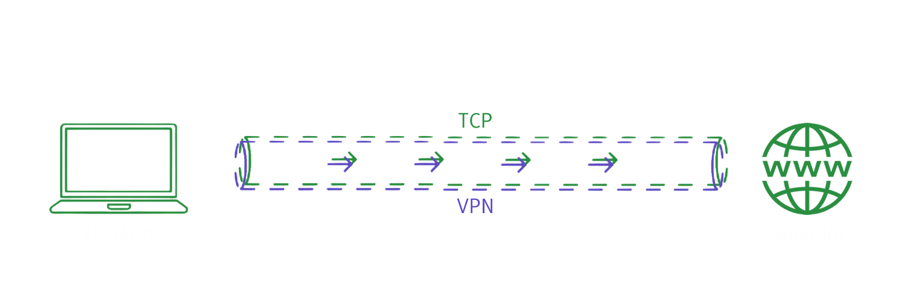
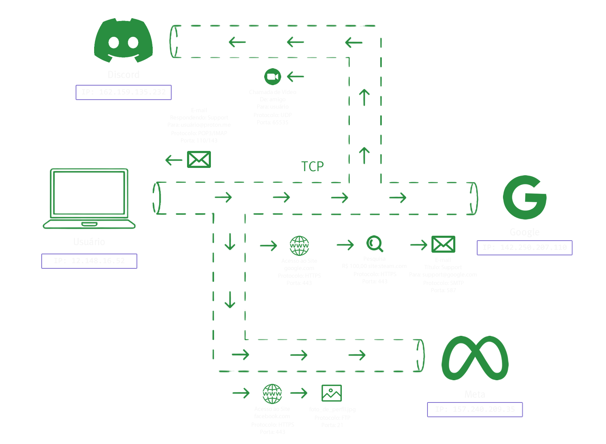
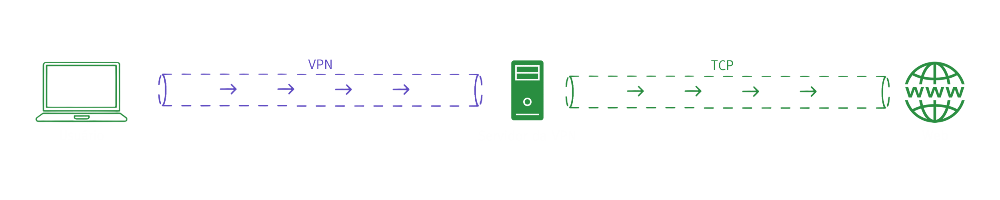

## VPN

**Traduções**

- [EN-US](../vpn.md)
- [PT-BR](./vpn.md)

## Navegação
<details>
<summary><b>Menu</b></summary>

- [O que é VPN](#o-que-é-vpn)
- [Entendendo o VPN](#entendendo-o-vpn)
- [Instalando Ferramentas](#instalando-ferramentas)
- [Testando na Prática](#testando-na-prática)
- [Exercício](#exercício)
</details>

<br />

## O que é VPN?

Uma VPN (Virtual Private Network), é basicamente um túnel que carrega os dados do tráfego de forma criptografada entre o dispositivo de um usuário e o servidor de destino.

Na imagem abaixo vemos uma pequena abstração de como isso funciona.

<br />
<center>

</center>
<br />

Como já vimos na [primeira aula de Cyber Segurança](../4_cyber_security_p1/cyber_security_p1.md) e também na aula de [Protocolos de Rede](../7_network_protocols/network_protocols.md), quando nos conectamos a internet através de qualquer dispositivo (computadores, laptops, tablets, smart phones, smart watches, smart refrigerators, smart cars, smart houses, etc); Usamos uma série de protocolos de rede.

A requisição sempre sai do seu dispositivo e vai para outros dispositivos (servidores), e para cada destino que desejamos alcançar, existem diferentes rotas (diferentes endereços de IP).

Observemos todos os percursos de protocolos ocorrendo entre as plataformas.

<br />
<center>
	
</center>
<br />

Na imagem podemos ver os seguintes processos acontecendo:

O Usuário com o IP `12.148.16.52` acessa o `Discord` que está localizado no endereço de IP `162.159.135.232` e faz uma chamada de vídeo através do protocolo `UDP`;

- O que corresponde à: Usuário `➔` Discord `➔` Chamada de Vídeo (`UDP`).

O Usuário com o IP `12.148.16.52` acessa o `Facebook` que está localizado no endereço de IP `157.240.209.35` através do Protocolo `HTTPS` e envia uma nova foto de perfil no formato `JPG` através do protocolo `FTP`;

- O que corresponde à: Usuário `➔` Facebook `➔` Envio de Foto de Perfil (`FTP`).

O Usuário com o IP `12.148.16.52` acessa o `Google` que está localizado no endereço de IP `142.250.207.110` e primeiro faz uma busca no Google, em depois, envia um e-mail através do protocol `SMTP`;

- O que corresponde à: Usuário `➔` Google `➔` Pesquisa (`HTTPS`) `➔` E-mail (`SMTP`).

Agora que já revisamos alguns de nossos conhecimentos anteriores de Protocolos de Rede, podemos prosseguir com a nossa aula de Cyber Segurança Parte 2.

## Entendendo o VPN

### Vou entrar nesta parte já respondendo as perguntas mais básicas:

### “Para um Hacker ou um Provedor de Serviços de internet é possível saber quais sites um usuário está acessando e para onde estão indo as informações dele?”

A resposta é **sim, é possível**. Quando você se conecta a uma VPN, você passa a fazer uso de um túnel alternativo que não é o seu túnel convencional (TCP) do dia-a-dia que lhe é fornecido como caminho pela sua **ISP** (**Internet Service Provider**), ou seja, em simples palavras, você passa a fazer uso de um túnel com uma rota alternativa que lhe é fornecida pela tecnologia VPN.

### “Será que da pra saber quem está usando VPN?”

Sim, e não é nada difícil.

### “Quem tem a capacidade de saber que estou usando VPN?”

O seu provedor de serviços de internet (Internet Service Provider ou ISP como costumamos falar), empresas de terceiros, hackers e você.

### “Tem como saber qual site uma pessoa está acessando quando se está usando uma VPN?”

O túnel VPN trás consigo uma segurança de criptografia **AES 256** que é uma **criptografia militar** que até hoje não foi quebrada. Logo, em transito (durante o envio e recebimento de pacotes entre o cliente e o servidor), é impossível.

### “É possível localizar a pessoa que está utilizando a VPN?”

A resposta é **sim** e **não**, sim porque existe um meio, e não porque este meio na maioria dos casos é impraticável a não ser que já haja suspeitas e um mandado judicial, ou seja, uma investigação forense para que a polícia possa fazer isso.

Existem duas formas de fazer isto:

**1** - Em uma hipótese de uma pessoa querendo ter a certeza que determinada pessoa por trás de uma certa VPN é você, essa pessoa teria que comprometer o seu dispositivo seja ele qual for instalando um programa, software ou aplicativo mau intencionado que chamamos comumente de Backdoor (apesar de haverem outros tipos de ferramentas mau intencionadas para isto), para poder ter acesso a quais conexões são feitas, quais sites são acessados e etc.

**2** - A pessoa teria que ir até a sede da empresa que te fornece os serviços de VPN (que na maioria dos casos nem possui uma sede no Brasil), e pedir os logs de conexão por trás de determinados endereços de IP que tiveram atividade nos dias X, Y e horários Z.

> [!NOTE]
> 
> **Nota**: Boas empresas de VPN não coletam logs dos usuários, inclusive, nestes casos os servidores das VPNs não possuem nenhum tipo de memória ROM (HDD, SSD, M1, NVMe).

<br /><br />

Essa rota é importante e interessante de ser discutida com calma, pois, ela não só te da um caminho alternativo e diferente do TCP casual que você cotidianamente usa da sua ISP, como também embaralha as informações que entram, caminham, percorrem e saem deste túnel, até que no final do percurso essa informação chega no servidor VPN e por fim é enviada de fato para os caminhos cotidianos de um túnel cotidiano TCP.

<br />
<center>
	
</center>
<br />

Como podemos ver, esse túnel que chamamos de VPN, pode ser visto na verdade como um encapamento de um fio, um encapsulamento de um submarino ou até mesmo um cano por onde passa a água. Então as suas informações entram por esse cano, percorrem centenas de quilômetros dentro desse cano até chegar ao servidor da VPN, e por fim, é despejada na corrente do clássico TCP e dai por diante você volta a percorrer o caminho natural das coisas indo de endereço DNS em endereço DNS pelos fios intercontinentais DNS que atravessam os países por debaixo do mar.

Eu inclusive recomendo que vocês chequem o site da [Infrapedia](https://www.infrapedia.com/) para que possam visualizar o caminho dos cabos submarinos e subterrâneos usados para conectar toda a árvore DNS permitindo que a internet exista e que você da sua casa no Brasil, consiga acessar um servidor que na verdade está nos Estados Unidos.

<br /><br />
<center>
	
</center>
<br /><br />

E a seguir uma imagem de como é o cabo que transporta os dados da tão preciosa internet como conhecemos.

<br /><br />
<center>
	
</center>
<br /><br />

## Instalando Ferramentas

Para essa parte da aula eu vou pedir que você efetue o download da aplicação de VPN da [Proton](https://protonvpn.com/download) que tem um plano de uso gratuito e facilitará os nossos teste, mas vale ressaltar que tais testes podem ser feitos com quaisquer outros serviços de VPN, como [OpenVPN](https://openvpn.net/community-downloads/), [NordVPN](https://nordvpn.com/) e até mesmo extensões gratuitas de VPN para navegadores como, [Browsec](https://chromewebstore.google.com/detail/browsec-vpn-free-vpn-for/omghfjlpggmjjaagoclmmobgdodcjboh) ou a [Urban VPN & Proxy](https://chromewebstore.google.com/detail/urban-vpn-proxy/eppiocemhmnlbhjplcgkofciiegomcon), porém, para essa parte da aula utilizaremos o [Proton VPN](https://protonvpn.com/download).

Caso você ainda não tenha clicado em um dos links que disponibilizei acima, clique na imagem abaixo para fazer download da ferramenta.

<br /><br />
<center>
	<a href="https://protonvpn.com/download">
		
	</a>
</center>
<br /><br />

Acompanhe o vídeo abaixo para saber como efetuar a instalação:

<center>
    <br />
    <br />
    <video width="800" controls>
		<source src="./assets/proton_installation.mp4" type="video/mp4">
    </video>
    <br />
    <br />
</center>

Após feita a instalação, faça o login, para se conectar ao serviço do VPN gratuito. Basta seguir o vídeo abaixo:

<center>
    <br />
    <br />
    <video width="1920" controls>
		<source src="./assets/proton_connect.mp4" type="video/mp4">
    </video>
    <br />
    <br />
</center>

Agora precisamos baixar um outro software, que é o [WireShark](https://www.wireshark.org/download.html), após baixar, basta acompanhar o vídeo abaixo para a instalação:

> [!NOTE]
> 
> **Nota 1**: Certifique-se de sempre instalar o NPCap, neste caso eu não o instalei, pois eu já o tinha instalado em meu dispositivo.
> **Nota 2**: Você não precisa marcar nenhuma opção durante a instalação do **NPCap**, só clique em **Install** e prossiga.

<center>
    <br />
    <br />
    <video width="800" controls>
		<source src="./assets/wireshark_installation.mp4" type="video/mp4">
    </video>
    <br />
    <br />
</center>

## Testando na Prática

Agora com o Wireshark e o nosso serviço de VPN gratuito instalados, vamos colocar as mãos na massa!

**1** - Abra o Wireshark.<br />
**2** - Abra o Proton VPN.<br />
**3** - Abra o seu navegador web de sua preferência.<br />
**4** - Divida a sua tela em duas arrastando o Wireshark para a direita, e o navegador na esquerda.<br />
**5** - Escolha a sua conexão de rede principal que você está utilizando para navegar na internet neste momento (certifique-se de escolher a conexão de rede correta);<br />
**6** - Agora dentro do Wireshark, na parte superior esquerda, clique no ícone da barbatana superior do tubarão.<br />
**7** - Observe que uma série de informações surgiram, informações contendo pacotes, protocolos, endereços de IP e etc.<br />
**8** - Dentro do Proton VPN, clique em **Quick Connect**.<br />
**9** - Agora observe novamente dentro do Wireshark, você notará que todos os protocolos anteriores foram substituídos pelos protocolos `Wire`, `WireGuard` e `MDNS` que são os protocolos responsáveis pela criptografia (embaralhamento da informação) e segurança do VPN e também os endereços de IP de destino do serviço de VPN.<br />
**10** - Desconecte-se do VPN.<br />
**11** - Agora abra o Terminal.<br />
**12** - Execute o comando de consulta de DNS (nslookup) e passe como argumento um site ou um endereço IP`, (um exemplo do comando pode ser visto logo abaixo desta etapa). Repita o comando múltiplas vezes e observe dentro do Wireshark o protocolo DNS aparecendo constantemente, isto é o que acontece na sua ISP quando você acessa um site, eles conseguem ver o endereço DNS por trás do nome de domínio (nome so site) que você está acessando.<br />

```
nslookup google.com
```

**12** - Após, efetuar sua análise e observação. Dentro do Wireshark você já pode pausar o rastreio de pacotes (packets) de rede clicando no botão com um formato de um quadrado vermelho bem ao lado do ícone da barbatana azul que você clicou anteriormente.<br />

Essa é a visão que a sua ISP tem do tráfego de internet vindo do seu IP. 

> [!NOTE]
> **Nota**: Veja o vídeo abaixo caso não tenha conseguido executar os passos explicador acima.

<center>
    <br />
    <br />
    <video width="1920" controls>
		<source src="./assets/packet_tracking.mp4" type="video/mp4">
    </video>
    <br />
    <br />
</center>
<br />
<br />

# Exercício

Neste exercício faremos uma simulação de um dia-a-dia real de funcionário de T.I, onde eu serei o seu Techlead e você será o Software Engineer.

Você trabalha dentro de uma <a href="#">**ISP**</a> do **Brasil** (por exemplo, a **VIVO** ou a **TIM**), e foi aberto um ticket para o setor de T.I da empresa para que o [𝕏](https://x.com) seja bloqueado.

Com os seus conhecimentos em Cyber Segurança para levantamentos de dossiê e Protocolos de Rede para entendimento dos protocolos e rastreamento de pacotes até agora obtidos execute as seguintes tarefas:

- Encontre o endereço de IP do [𝕏](https://x.com);
- Encontre os endereços DNS do [𝕏](https://x.com);
- Verifique se o [𝕏](https://x.com) possui um CloudFlare ou CDN;
- Traga no mínimo 3 possíveis soluções para bloquear o [𝕏](https://x.com).

> [!NOTE]
> **Nota**: Você pode pesquisar na internet para buscar por maneiras de bloquear um DNS, mas terá que entender como funciona.
> - Leve as sugestões para a equipe de T.I e para o Techlead em formato de uma apresentação das suas abordagens e explique o porque usar aquelas abordagem e porque.

# Credits

| [<br /><sub>@sdkitagawa</sub>](https://github.com/sdkitagawa) |
| :---: |
