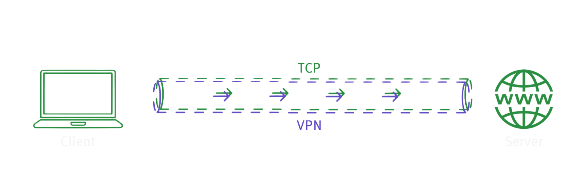
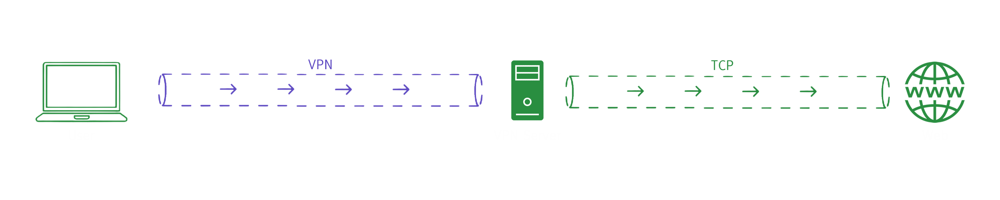

## VPN

**Translations**

- [EN-US](./vpn.md)
- [PT-BR](./pt_br/vpn.md)

## Navigation

<b>Menu</b>

- [What is VPN](#what-is-vpn)
- [Understanding VPN](#understanding-vpn)
- [Installing Tools](#installing-tools)
- [Practical Testing](#practical-testing)
- [Exercise](#exercise)

 

# What is VPN?

A VPN (Virtual Private Network) is basically a tunnel that carries traffic data encrypted between a user's device and the destination server.

In the image below we see a simple abstraction of how this works.

 

	

 

As seen in the [first Cyber Security class](../4_cyber_security_p1/cyber_security_p1.md) and in the [Network Protocols class](../7_network_protocols/network_protocols.md), when we connect to the internet using any device (computers, laptops, tablets, smartphones, smart watches, smart refrigerators, smart cars, smart homes, etc.), we use a series of network protocols.

Requests always leave your device and go to other devices (servers), and for each destination we want to reach, there are different routes (different IP addresses).

Let's observe all protocol paths occurring between platforms.

 

	

 

In the image, we can see the following processes happening:

The user with IP `12.148.16.52` accesses `Discord` at IP `162.159.135.232` and makes a video call via `UDP`;

- Which corresponds to: User `➔` Discord `➔` Video Call (`UDP`).

The user with IP `12.148.16.52` accesses `Facebook` at IP `157.240.209.35` via `HTTPS` and uploads a new profile picture in `JPG` format via `FTP`;

- Which corresponds to: User `➔` Facebook `➔` Upload Profile Picture (`FTP`).

The user with IP `12.148.16.52` accesses `Google` at IP `142.250.207.110`, first performing a Google search, then sending an email via `SMTP`;

- Which corresponds to: User `➔` Google `➔` Search (`HTTPS`) `➔` Email (`SMTP`).

Now that we have reviewed some of our previous Network Protocol knowledge, we can continue with Cyber Security Part 2.

# Understanding VPN

### Let’s answer the most basic questions first:

### “Can a Hacker or an Internet Service Provider know which sites a user is visiting and where their information is going?”

The answer is **yes, it’s possible**. When you connect to a VPN, you start using an alternative tunnel instead of your regular TCP tunnel provided by your **ISP** (**Internet Service Provider**). In simple words, you start using a tunnel with an alternative route provided by the VPN technology.

### “Is it possible to know if someone is using a VPN?”

Yes, and it is not difficult.

### “Who can know that I am using a VPN?”

Your ISP, third-party companies, hackers, and yourself.

### “Can someone see which site a person is accessing while using a VPN?”

The VPN tunnel provides **AES 256 encryption**, which is a **military-grade encryption** that has never been broken. Therefore, in transit (while sending and receiving packets between the client and the server), it is impossible to know.

### “Is it possible to locate a person using a VPN?”

The answer is **yes** and **no**. Yes, because there is a way; no, because in most cases it is impractical unless there is suspicion and a judicial warrant, i.e., a forensic investigation by authorities.

There are two ways to do this:

**1** - If someone wants to be sure that a person behind a VPN is you, they would have to compromise your device by installing malicious software, commonly called a Backdoor (though there are other malicious tools) to access connections, visited sites, etc.

**2** - The person would have to go to the VPN company that provides the service (most of which may not even have a headquarters in Brazil) and request connection logs for specific IPs active on certain dates and times.

> [!NOTE]
> 
> **Note**: Good VPN companies do not keep user logs; their servers often have no ROM memory (HDD, SSD, M1, NVMe).

  

This route is important to discuss because it not only provides an alternative to the normal TCP tunnel you use daily, but it also scrambles information traveling through the tunnel until it reaches the VPN server and is finally sent to the normal TCP route.

 

	

 

The VPN tunnel can be seen as a pipe, a submarine enclosure, or a conduit. Information enters this pipe, travels hundreds of kilometers, reaches the VPN server, and is then released into the normal TCP flow. This allows, for example, someone in Brazil to access a server in the United States.

I recommend checking [Infrapedia](https://www.infrapedia.com/) to visualize submarine and underground cables connecting the global DNS tree.

  

	

  

The image below shows the actual cable that carries internet data.

  

	

  

# Installing Tools

For this part of the class, download the [Proton VPN](https://protonvpn.com/download) app, which has a free plan and will help with our tests. You can also use other VPN services like [OpenVPN](https://openvpn.net/community-downloads/), [NordVPN](https://nordvpn.com/), or browser extensions like [Browsec](https://chromewebstore.google.com/detail/browsec-vpn-free-vpn-for/omghfjlpggmjjaagoclmmobgdodcjboh) or [Urban VPN & Proxy](https://chromewebstore.google.com/detail/urban-vpn-proxy/eppiocemhmnlbhjplcgkofciiegomcon). For this lesson, we will use [Proton VPN](https://protonvpn.com/download).

Click the image below to download the tool.

  

	

  

Follow the video below for installation:

     
     
		<iframe width="560" height="315" src="https://www.youtube.com/embed/ONHiiN33ajE?si=vUfdgj17uWeq3Tw-" title="YouTube video player" frameborder="0" allow="accelerometer; autoplay; clipboard-write; encrypted-media; gyroscope; picture-in-picture; web-share" referrerpolicy="strict-origin-when-cross-origin" allowfullscreen></iframe>
     
     

After installation, log in and connect to the free VPN service. Follow the video:

     
     
		<iframe width="560" height="315" src="https://www.youtube.com/embed/aGQofGlWzfs?si=MjnK0GtZzxP01DOS" title="YouTube video player" frameborder="0" allow="accelerometer; autoplay; clipboard-write; encrypted-media; gyroscope; picture-in-picture; web-share" referrerpolicy="strict-origin-when-cross-origin" allowfullscreen></iframe>
     
     

Next, download [Wireshark](https://www.wireshark.org/download.html) and follow the installation video:

> [!NOTE]
> 
> **Note 1**: Always install NPCap. In my case, I already had it installed.  
> **Note 2**: No options need to be selected during NPCap installation; just click **Install** and proceed.

     
     
		<iframe width="560" height="315" src="https://www.youtube.com/embed/yv4PN8f8iBk?si=xW1xF_28_PVraJ93" title="YouTube video player" frameborder="0" allow="accelerometer; autoplay; clipboard-write; encrypted-media; gyroscope; picture-in-picture; web-share" referrerpolicy="strict-origin-when-cross-origin" allowfullscreen></iframe>
     
     

# Practical Testing

With Wireshark and the free VPN installed:

**1** - Open Wireshark.  
**2** - Open Proton VPN.  
**3** - Open your preferred web browser.  
**4** - Split your screen (Wireshark on right, browser on left).  
**5** - Select your main network connection.  
**6** - In Wireshark, click the shark fin icon (top left).  
**7** - Observe packet, protocol, and IP information.  
**8** - In Proton VPN, click **Quick Connect**.  
**9** - Notice the protocols change to `Wire`, `WireGuard`, and `MDNS`, and the destination IPs now belong to the VPN.  
**10** - Disconnect VPN.  
**11** - Open Terminal.  
**12** - Run DNS lookup commands (`nslookup google.com`) multiple times and observe DNS packets in Wireshark. This simulates your ISP's view of your traffic.

**12** - After analysis, pause Wireshark packet capture (click the red square near the shark fin icon).  

This represents the ISP's perspective of your internet traffic.

> [!NOTE]
> **Note**: Watch the video below if you were unable to carry out the steps explained above.

     
     
		<iframe width="560" height="315" src="https://www.youtube.com/embed/UX7I2Uuz-Tw?si=8tkc_1XPaHZIg1KV" title="YouTube video player" frameborder="0" allow="accelerometer; autoplay; clipboard-write; encrypted-media; gyroscope; picture-in-picture; web-share" referrerpolicy="strict-origin-when-cross-origin" allowfullscreen></iframe>
     
     

 
 

# Exercise

Simulate a day in the life of a Brazilian ISP employee, where you are a Software Engineer and I am your Techlead.

A ticket has been opened to block [𝕏](https://x.com).

Using your Cyber Security knowledge for reconnaissance and Network Protocol knowledge for packet tracking:

- Find the IP address of [𝕏](https://x.com);  
- Find the DNS addresses of [𝕏](https://x.com);  
- Check if [𝕏](https://x.com) uses CloudFlare or a CDN;  
- Provide at least 3 possible solutions to block [𝕏](https://x.com).

> [!NOTE]
> 
> **Note**: Research DNS blocking methods if needed, but understand how it works.
> - Present your suggestions to the IT team and Techlead, explaining the reasoning behind each approach.

# Credits

| [ @sdkitagawa](https://github.com/sdkitagawa) |
| :---: |
